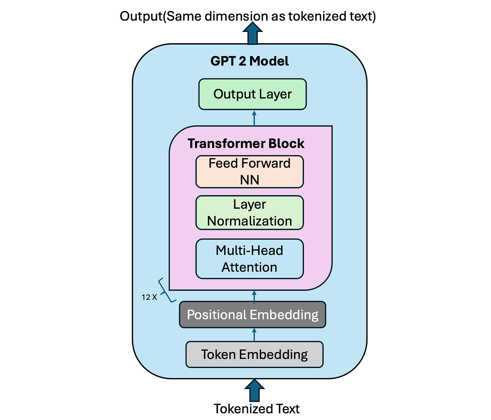

# FakeWiki

The goal of this project was to create a model that **mimics the style of Wikipedia's articles**. It was achived by building a **GPT2-like decode-only transformer**.  
Generated articles are placed on a Wikipedia-like website.  
The project was inspired by Andrej Karpathy's _Zero to Hero_ series

# [The website](https://mzums.com/fakewiki)

## The model

### Roadmap:

- bigrams
- single head self-attention
- multi head self-attention
- feed forward
- transformer block
- skip connection
- layer norm
- tokenizing
  - bpe
  - 3.4x compression ratio (for 1041830 characters in the dataset and vocab_size=5000)
  - I will probably use tiktoken in the end (4.3x compressionratio for now)
- building the actual model
  - rubbish generation using tiktoken weights
  - (?) rubbish generation using my tokenizer
  - optimization
    - change `set_float32_matmul_precision`
    - BFLOAT16
    - `torch.compile`
    - FlashAttention
    - change vocab size to 50304
    - learning rate decay
    - fused AdamW
    - gradient accumulation
    - DDP (although I have only 1 GPU)
      - use `require_backward_grad_sync`



<sub>from https://medium.com/@vipul.koti333/from-theory-to-code-step-by-step-implementation-and-code-breakdown-of-gpt-2-model-7bde8d5cecda</sub>

## Dataset

The model was trained on Wikipedia articles from https://dumps.wikimedia.org/enwiki/latest (`enwiki-latest-pages-articles.xml.bz2`).  
After the initial training it became clear that there is an overrepresentation of articles related to sports on Wikipedia so I filtered _Wanted article titles_, mostly referring to STEM (that must occur in my dataset) and _Unwanted articles_, mostly related to sports (that mustn't occur) and also some random articles so that they sum to 1.500.000 using [Petscan](https://petscan.wmcloud.org/).  
[Read more...](data_preparation.md)

## Tokenization

I used GPT-2 tokenizer although this repo also contains my experiments with building a custom tokenizer ([tokenization.ipynb](dev/tokenization.ipynb) and [my_tokenizer.py](dev/my_tokenizer.py))

## Training

The model was trained on RTX 4060Ti 16GB on 4GB of data  
Starting from loss ~ 11 it reached loss ~ 2,86 after 20000 steps of training

### _Did you know..._ section

The model was finetuned for 250 steps on ~33.5k DYK questions scraped from Wikipedia.

### _On this day_ section

Wikipedia contains only about 1.8k OTD entries, which is not sufficient to finetune the model and make it's predictions accurate

## Generation

### Article generation prompt

```
TITLE: {title}

## Abstract
{title}
```

### DYK generation prompt

```
... that
```

## Weaknesses of the model

- The model does not have reasonable world knowledge
- The model naturally repeats some phrases. This can be later eliminated in generation (I am using `frequency_penalty=0.2` and `presence_penalty=0.1`, higher values ​​caused the model to generate fewer article sections)
- The model does not generate lists (due to absence of lists in training data)
